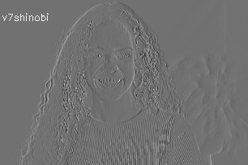
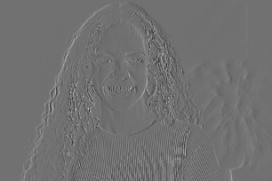

# 🖼️ **DWT-Based Image Watermarking**

This project demonstrates **watermark embedding in grayscale images using the Discrete Wavelet Transform (DWT) domain**. It compares a manual DWT implementation with PyWavelets, embedding a text-based watermark in high-frequency bands of an image to ensure imperceptibility and robustness.

---

## 🚀 **Project Overview**

Watermarking in the **wavelet domain** offers improved robustness and imperceptibility by modifying selective subbands of the image. This project focuses on:

- Embedding a watermark in the **cH (horizontal detail)** sub-band using both manual and built-in DWT.
- Reconstructing the image using inverse DWT.
- Comparing performance using PSNR, SSIM, RMSE, and timing.
- Visualizing DWT subbands and the effect of watermark embedding.

---

## 🧠 **Features**

- ✅ Manual 2D Haar DWT and IDWT implementation.
- ✅ Watermarking in the horizontal detail coefficients (cH).
- ✅ Quality evaluation using PSNR, SSIM, RMSE.
- ✅ Timing comparison between manual and PyWavelets methods.
- ✅ Heatmaps and difference images to analyze watermark embedding.

---


## 📸 Visualizations

### 📷 Original Image

> Input image used for watermarking.

<table>
  <tr>
    <td align="center">
      <br/>
      <b>Original Image</b>
    </td>
  </tr>
</table>

### 🔠 DWT Coefficients

> LL (low-low), LH (low-high), HL (high-low), HH (high-high)

- Manual
<table>
  <tr>
    <td align="center">
      <br/>
      <b>LL Sub-band</b>
    </td>
    <td align="center">
      <br/>
      <b>HH Before Watermark</b>
    </td>
    <td align="center">
      <br/>
      <b>HH After Watermark</b>
  </tr>
</table>

- Built-in
<table>
  <tr>
    <td align="center">
      <br/>
      <b>LL Sub-band</b>
    </td>
    <td align="center">
      <br/>
      <b>HH Before Watermark</b>
    </td>
    <td align="center">
      <br/>
      <b>HH After Watermark</b>
  </tr>
</table>

- Spatial Image Differences
<table>
  <tr>
    <td align="center">
      <br/>
      <b>Original Image</b>
    </td>
    <td align="center">
      <br/>
      <b>Manual vs Built-in Diff</b>
    </td>
  </tr>
</table>

### 🖼️ Watermarked Image

<table>
  <tr>
    <td align="center">
      <br/>
      <b>Watermarked Manual</b>
    </td>
    <td align="center">
      <br/>
      <b>Watermarked Built-in</b>
    </td>
  </tr>
</table>

### 🔍 Difference Image & Heatmap

> Shows pixel-level changes introduced by the watermark.

<table>
  <tr>
    </td>
    <td align="center">
      <br/>
      <b>Manual cH Diff</b>
    </td>
    </td>
    <td align="center">
      <br/>
      <b>Built-in cH Diff</b>
    </td>
    </td>
  </tr>
</table>

---## 🔍 **Methodology**

1. Load a grayscale image.
2. Apply single-level Haar DWT (manual and built-in).
3. Generate watermark using OpenCV.
4. Embed watermark in cH sub-band using a scaling factor (α = 100).
5. Apply inverse DWT to reconstruct the watermarked image.
6. Evaluate results using PSNR, SSIM, RMSE.
7. Visualize subbands and differences.

---

## 🛠️ **Installation**

```bash
pip install opencv-python numpy matplotlib pywt scikit-image
```

---

## 📌 Usage

1. Clone or download this repository.
2. Add a grayscale image named `professional.jpg` to the working directory.
3. Run the notebook `dwt-watermarking.ipynb`.

The notebook outputs:

- DWT bands and reconstructed images
- Image differences and heatmaps
- Evaluation metrics and timing

---

## 📊 Performance Metrics

| **Metric** | **Manual DWT** | **Built-in DWT** |
|------------|----------------|------------------|
| PSNR       | 40.686353 dB   | 40.797219 dB     |
| SSIM       | 0.990420       | 0.991193         |
| RMSE       | 0.740769       | 0.655218         |
| DWT Time   | 1.448282 s     | 0.004684 s       |
| IDWT Time  | 1.401595 s     | 0.004572 s       |

---

## ✔ **Conclusion**

This project shows that **wavelet-domain watermarking**:

- Offers high imperceptibility with negligible distortion.
- Works efficiently with built-in libraries like PyWavelets.
- Reveals valuable insights through visual and quantitative comparisons.

---

## 💡 Future Enhancements

- Implement **watermark extraction** and verification.
- Test **robustness** against noise, compression, and cropping.
- Expand to **color image watermarking**.
- Explore **multi-level DWT** for stronger, more hidden watermarking.

---

**Developed by [Dipanshu Modi](https://github.com/dipanshumodi31)**
